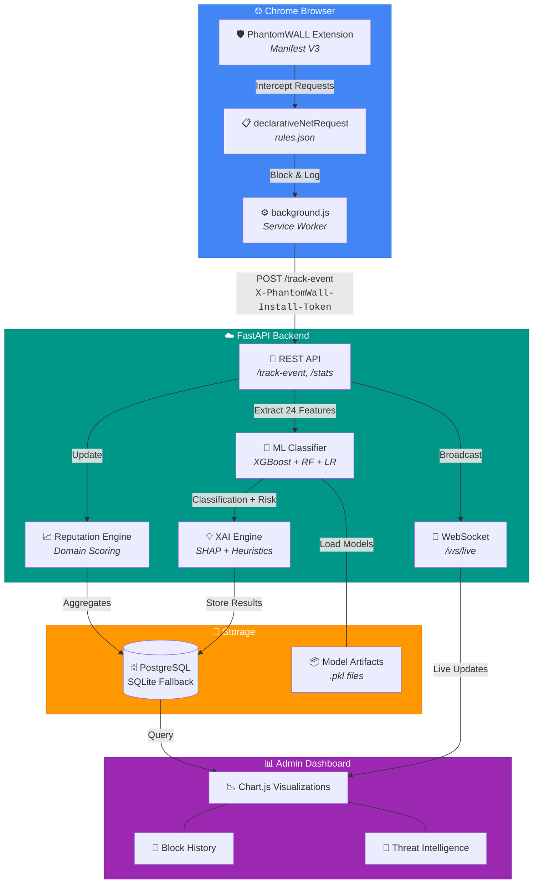
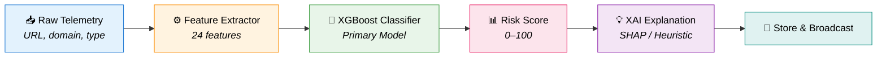
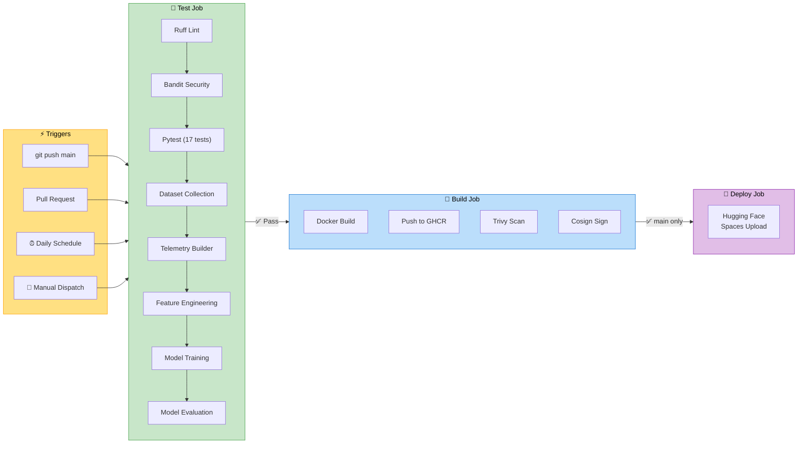

<div align="center">

# 🛡️ PhantomWALL

### **AI-Powered Browser Privacy Defense System**

[](https://github.com/tanzzz07/PhantomWALL/actions/workflows/docker-publish.yml)
[](https://python.org)
[](https://fastapi.tiangolo.com)
[](https://xgboost.readthedocs.io)
[](https://developer.chrome.com/docs/extensions/mv3/)
[](https://docker.com)
[](https://huggingface.co)
[](LICENSE)

<br />

**PhantomWALL** is a distributed browser privacy defense platform combining a **Chrome MV3 extension** with a **FastAPI + XGBoost backend**. It intercepts, classifies, and blocks tracker requests in real-time using machine learning — providing explainable threat intelligence, dynamic risk scoring, and a live admin dashboard.

<br />

[🚀 Quick Start](#-quick-start) · [🏗️ Architecture](#%EF%B8%8F-architecture) · [🤖 ML Pipeline](#-ml-classification-pipeline) · [📡 API Reference](#-api-reference) · [🔄 CI/CD](#-cicd-pipeline)

</div>

---

## ✨ Feature Highlights

<table>
<tr>
<td width="50%">

### 🔒 Extension
- **Chrome MV3** `declarativeNetRequest` blocking
- Offline-first local analytics
- One-click install registration
- Authenticated telemetry pipeline
- Real-time popup with block stats

</td>
<td width="50%">

### 🧠 Intelligence
- **XGBoost** multi-class tracker classification
- 24-feature extraction (entropy, URL patterns, behavior)
- Dynamic risk scoring (0–100)
- SHAP-based Explainable AI (XAI)
- Domain reputation aggregation

</td>
</tr>
<tr>
<td width="50%">

### 📊 Dashboard
- Interactive Chart.js threat visualizations
- Paginated, searchable block history
- Drill-down event detail drawers
- Top domains & risk distribution
- Real-time WebSocket updates

</td>
<td width="50%">

### ⚙️ Platform
- FastAPI with PostgreSQL / SQLite
- Multi-user JWT auth (admin + user scopes)
- Auto-migration (no Alembic needed)
- 30-day retention with reputation preservation
- Docker + GitHub Actions CI/CD → Hugging Face

</td>
</tr>
</table>

---

## 🏗️ Architecture



---

## 🤖 ML Classification Pipeline

PhantomWALL uses a multi-model ML pipeline that classifies every request into one of **5 threat categories**:

| Category | Color | Risk Weight | Description |
|:---:|:---:|:---:|:---|
| 🟢 **Safe** | Green | `0.10` | Normal first-party resources |
| 🔵 **Analytics** | Blue | `0.40` | Telemetry & measurement trackers |
| 🔴 **Advertising** | Red | `0.60` | Ad networks & programmatic bidding |
| 🟠 **Fingerprinting** | Orange | `0.85` | Device/browser fingerprinting scripts |
| 🟣 **Suspicious** | Purple | `1.00` | Cryptominers, malware beacons, unknown threats |

### Pipeline Flow



### 24 Extracted Features

<details>
<summary><b>🔍 Click to expand full feature list</b></summary>

| # | Feature | Category | Description |
|:---:|:---|:---:|:---|
| 1 | `domain_length` | Domain | Length of the registered domain |
| 2 | `subdomain_depth` | Domain | Number of subdomain levels |
| 3 | `entropy` | Domain | Shannon entropy of the domain string |
| 4 | `tld_risk_score` | Domain | Risk score based on TLD (`.xyz`, `.tk` = high) |
| 5 | `digit_ratio` | Domain | Ratio of digits to total characters |
| 6 | `hyphen_count` | Domain | Count of hyphens in domain |
| 7 | `url_length` | URL | Total URL string length |
| 8 | `path_depth` | URL | Number of path segments (`/` count) |
| 9 | `query_parameter_count` | URL | Number of query parameters |
| 10 | `query_parameter_length` | URL | Total length of query string |
| 11 | `special_character_count` | URL | Count of special chars (`? & = %` etc.) |
| 12 | `analytics_keyword_score` | Keyword | Hits on analytics terms (`ga.js`, `telemetry`) |
| 13 | `advertising_keyword_score` | Keyword | Hits on ad terms (`doubleclick`, `pixel`) |
| 14 | `fingerprinting_keyword_score` | Keyword | Hits on FP terms (`canvas`, `webgl`) |
| 15 | `tracker_keyword_score` | Keyword | Hits on general tracker terms |
| 16 | `third_party_flag` | Behavior | Whether request is third-party |
| 17 | `request_frequency` | Behavior | Request rate per domain |
| 18 | `request_type` | Behavior | Encoded type (script, image, XHR, etc.) |
| 19 | `referrer_domain_similarity` | Behavior | Similarity between request & referrer domains |
| 20 | `session_occurrence_count` | Behavior | Same-session domain occurrence count |
| 21 | `suspicious_character_count` | Security | Chars like `; ( ) { } < >` in URL |
| 22 | `encoded_character_ratio` | Security | Ratio of `%`-encoded chars |
| 23 | `high_entropy_subdomain` | Security | Flag for high-entropy subdomains (>3.5) |
| 24 | `tracking_pattern_score` | Pattern | UTM params, tracking paths detected |

</details>

### Model Comparison

The pipeline trains and evaluates **3 models**, automatically selecting the best performer:

```
┌─────────────────────────────────────────────────────────────────────┐
│                    Model Selection Engine                          │
├──────────────────────┬────────────────┬────────────────────────────┤
│  Logistic Regression │  Random Forest │       XGBoost (Primary)    │
│  ──────────────────  │  ────────────  │  ──────────────────────    │
│  • Fast inference    │  • Robust      │  • Best accuracy           │
│  • Interpretable     │  • No overfit  │  • Handles missing vals    │
│  • Lightweight       │  • Feature imp │  • Gradient boosted        │
│  • Linear baseline   │  • Ensemble    │  • Production default      │
├──────────────────────┴────────────────┴────────────────────────────┤
│  Selection Criteria: Macro F1 Score → Exported as phantomwall_model│
└─────────────────────────────────────────────────────────────────────┘
```

### Risk Score Formula

```
risk_score = category_weight × model_confidence × 100
```

### Explainable AI (XAI)

Every prediction includes a human-readable explanation via:
1. **SHAP TreeExplainer** — exact feature attributions when `shap` is installed
2. **Rule-based heuristic fallback** — inspects feature values and identifies top contributing indicators

---

## 📁 Project Structure

```
PhantomWALL/
├── 🌐 extension/
│   ├── manifest.json              # MV3 manifest
│   ├── background.js              # Service worker + telemetry pipeline
│   ├── rules.json                 # declarativeNetRequest rules
│   ├── popup.html / popup.js      # Extension popup UI
│   ├── options.html / options.js  # Setup & registration page
│   └── styles.css / options.css   # Extension styling
│
├── ☁️ backend/
│   ├── app/
│   │   ├── api/routes/            # analytics, auth, installs, live, predict
│   │   ├── core/                  # config, security, dependencies
│   │   ├── models/                # SQLAlchemy ORM models
│   │   ├── services/              # analytics, classifier, XAI, retention
│   │   └── static/                # dashboard HTML/JS/CSS
│   ├── dataset_pipeline/
│   │   ├── collector.py           # EasyList, EasyPrivacy, Disconnect, Tranco
│   │   └── telemetry_dataset_builder.py  # Synthetic telemetry generation
│   ├── feature_engineering/
│   │   ├── extractor.py           # 24-feature extraction
│   │   └── analysis.py            # Dataset statistics & visualizations
│   ├── training/
│   │   └── trainer.py             # LR + RF + XGBoost training
│   ├── evaluation/
│   │   ├── evaluator.py           # Model comparison & selection
│   │   └── shap_analysis.py       # SHAP explainability plots
│   ├── inference/
│   │   └── predictor.py           # Runtime prediction service
│   ├── models/                    # Trained .pkl artifacts
│   ├── reports/                   # Generated plots & reports
│   ├── tests/                     # Pytest test suite (17 tests)
│   ├── requirements.txt
│   └── Dockerfile
│
├── .github/workflows/
│   └── docker-publish.yml         # CI/CD pipeline
├── docker-compose.yml
└── README.md
```

---

## 🚀 Quick Start

### 1️⃣ Start the Backend

```bash
docker compose up --build
```

| Service | URL |
|:---|:---|
| 🔌 API | `http://localhost:8000` |
| 📊 Dashboard | `http://localhost:8000/dashboard` |
| 🗄️ PostgreSQL | `localhost:5432` |

### 2️⃣ Load the Extension

1. Navigate to `chrome://extensions`
2. Enable **Developer mode** (top-right toggle)
3. Click **Load unpacked**
4. Select the `extension/` folder

### 3️⃣ Configure the Extension

The options page opens automatically on first install. Use these local values:

| Setting | Value |
|:---|:---|
| Backend URL | `http://localhost:8000` |
| Install Name | `My Laptop` (anything descriptive) |
| Invite Code | `phantomwall-invite` |

Click **Register Install** ✅

### 4️⃣ Open the Admin Dashboard

Visit `http://localhost:8000/dashboard`

| Credential | Default Value |
|:---|:---|
| Username | `admin` |
| Password | `change-this-password` |

### 5️⃣ Generate Telemetry

Browse websites with common trackers → Watch the dashboard update in real-time with classified threats, risk scores, and block history.

---

## 🔧 Local Development (Without Docker)

```bash
cd backend
python -m venv .venv
.venv\Scripts\activate        # Windows
# source .venv/bin/activate   # macOS/Linux

pip install -r requirements.txt
uvicorn app.main:app --reload --host 0.0.0.0 --port 8000
```

> **Note:** Requires a running PostgreSQL instance and a valid `PHANTOMWALL_DATABASE_URL`. Without PostgreSQL, the backend falls back to SQLite automatically.

---

## 🌍 Environment Variables

| Variable | Description | Default |
|:---|:---|:---|
| `PHANTOMWALL_DATABASE_URL` | Database connection string | SQLite fallback |
| `PHANTOMWALL_PUBLIC_BACKEND_URL` | Public-facing API URL | `http://localhost:8000` |
| `PHANTOMWALL_ADMIN_USERNAME` | Dashboard admin username | `admin` |
| `PHANTOMWALL_ADMIN_PASSWORD` | Dashboard admin password | `change-this-password` |
| `PHANTOMWALL_JWT_SECRET_KEY` | JWT signing secret | `change-this-jwt-secret` |
| `PHANTOMWALL_REGISTRATION_INVITE_CODE` | Extension registration code | `phantomwall-invite` |
| `PHANTOMWALL_CORS_ORIGINS` | Comma-separated allowed origins | `http://localhost` |

See `backend/.env.example` for the complete list.

---

## 📡 API Reference

### Authentication

| Endpoint | Method | Auth | Description |
|:---|:---:|:---:|:---|
| `/auth/register` | `POST` | — | Create new dashboard user |
| `/auth/login` | `POST` | — | Get JWT token |
| `/auth/me` | `GET` | 🔑 JWT | Current user info |

### Telemetry & Installs

| Endpoint | Method | Auth | Description |
|:---|:---:|:---:|:---|
| `/installs/register` | `POST` | Invite Code | Register browser install |
| `/installs` | `GET` | 🔑 JWT | List registered installs |
| `/track-event` | `POST` | 🔑 Install Token | Ingest telemetry event |

### Analytics & Intelligence

| Endpoint | Method | Auth | Description |
|:---|:---:|:---:|:---|
| `/stats` | `GET` | 🔑 JWT | Aggregated analytics |
| `/history` | `GET` | 🔑 JWT | Paginated block history |
| `/history/stats` | `GET` | 🔑 JWT | Threat distribution & timelines |
| `/history/top-domains` | `GET` | 🔑 JWT | Top blocked domains |
| `/reputation` | `GET` | 🔑 JWT | Domain reputation records |
| `/reputation/top-risk` | `GET` | 🔑 JWT | Highest-risk domains |

### Admin & Live

| Endpoint | Method | Auth | Description |
|:---|:---:|:---:|:---|
| `/dashboard` | `GET` | — | Admin dashboard UI |
| `/admin/cleanup` | `POST` | 🔑 Admin | Trigger retention cleanup |
| `/ws/live` | `WS` | 🔑 JWT (query) | Real-time event stream |
| `/api/predict` | `POST` | — | Direct ML prediction |

<details>
<summary><b>📝 Example: Track Event</b></summary>

```bash
curl -X POST http://localhost:8000/track-event \
  -H "Content-Type: application/json" \
  -H "X-PhantomWall-Install-Token: YOUR_TOKEN" \
  -d '{
    "tracker_domain": "google-analytics.com",
    "url": "https://www.google-analytics.com/g/collect?v=2",
    "page_origin": "https://example.com",
    "request_type": "xmlhttprequest",
    "source": "extension",
    "blocked": true,
    "third_party": true
  }'
```

</details>

<details>
<summary><b>📝 Example: ML Prediction</b></summary>

```bash
curl -X POST http://localhost:8000/api/predict \
  -H "Content-Type: application/json" \
  -d '{
    "url": "https://doubleclick.net/ad?size=300x250",
    "request_type": "image",
    "third_party": true,
    "request_frequency": 5,
    "referrer_domain": "https://news-site.com"
  }'
```

</details>

---

## 🔄 CI/CD Pipeline



### Pipeline Steps

| Step | Time | Description |
|:---|:---:|:---|
| 🔍 Lint + Security | ~15s | Ruff code quality + Bandit vulnerability scan |
| 🧪 Unit Tests | ~30s | 17 tests covering API, auth, classifiers, models |
| 📥 Dataset Collection | ~20s | Download EasyList, EasyPrivacy, Disconnect, Tranco |
| 🔄 Telemetry Builder | ~2s | Generate synthetic behavioral telemetry |
| ⚙️ Feature Engineering | ~3s | Extract 24 features from telemetry |
| 🤖 Model Training | ~3s | Train LR + RF + XGBoost |
| 📊 Model Evaluation | ~2s | Compare models, select best, generate reports |
| 🐳 Docker Build | ~60s | Build and push container to GHCR |
| 🚀 HF Deploy | ~30s | Upload to Hugging Face Spaces via `hf` CLI |

### Deploying to Hugging Face Spaces

1. Create a **Docker** space on [Hugging Face](https://huggingface.co/new-space) (blank Docker SDK)

2. Add GitHub repository secrets (**Settings → Secrets → Actions**):

   | Secret | Value |
   |:---|:---|
   | `HF_TOKEN` | Hugging Face write access token |
   | `HF_SPACE_NAME` | `username/space-name` (e.g. `tanzzz07/phantomwall`) |

3. Add HF Space environment variables:

   | Variable | Value |
   |:---|:---|
   | `PHANTOMWALL_DATABASE_URL` | `sqlite+aiosqlite:////app/data/phantomwall.db` |
   | `PHANTOMWALL_ADMIN_USERNAME` | Your dashboard username |
   | `PHANTOMWALL_ADMIN_PASSWORD` | Your dashboard password |
   | `PHANTOMWALL_JWT_SECRET_KEY` | A secure random string |
   | `PHANTOMWALL_REGISTRATION_INVITE_CODE` | Your invite code |
   | `PHANTOMWALL_PUBLIC_BACKEND_URL` | `https://<user>-<space>.hf.space` |

4. Push to `main` → CI runs → auto-deploys to HF! 🎉

---

## 🎯 Sample Tracker Coverage

The extension ships with rules blocking known trackers:

```
google-analytics.com    doubleclick.net         googletagmanager.com
facebook.com/tr         connect.facebook.net    ads-twitter.com
bat.bing.com            snap.licdn.com
```

The ML pipeline also trains on data from:
- **EasyList** — community ad-blocking rules (~10K domains)
- **EasyPrivacy** — privacy protection rules (~5K domains)
- **Disconnect** — categorized tracker database
- **Tranco** — top 5,000 safe domains for negative class

---

## 🔐 Production Checklist

- [ ] Replace default admin password and JWT secret
- [ ] Rotate the invite code
- [ ] Deploy behind HTTPS
- [ ] Replace sample rules with maintained tracker intelligence
- [ ] Consider data anonymization for strict privacy requirements
- [ ] Model artifacts in `backend/models/` required — retrain if feature schema changes
- [ ] Raw telemetry auto-purges after 30 days; domain reputation preserved indefinitely

---

## 🛠️ Tech Stack

<div align="center">

| Layer | Technologies |
|:---:|:---|
| 🌐 Extension | Chrome Manifest V3 · declarativeNetRequest · Service Workers |
| ☁️ Backend | FastAPI · Uvicorn · Pydantic · SQLAlchemy (async) |
| 🤖 ML | XGBoost · scikit-learn · SHAP · pandas · numpy |
| 🗄️ Database | PostgreSQL · SQLite (fallback) · asyncpg · aiosqlite |
| 📊 Dashboard | HTML5 · Chart.js · WebSockets · Vanilla CSS |
| 🐳 DevOps | Docker · GitHub Actions · GHCR · Hugging Face Spaces |
| 🔒 Security | JWT (PyJWT) · PBKDF2 password hashing · Cosign image signing |

</div>

---

<div align="center">

**Built with ❤️ for browser privacy**

[⬆️ Back to Top](#%EF%B8%8F-phantomwall)

</div>
